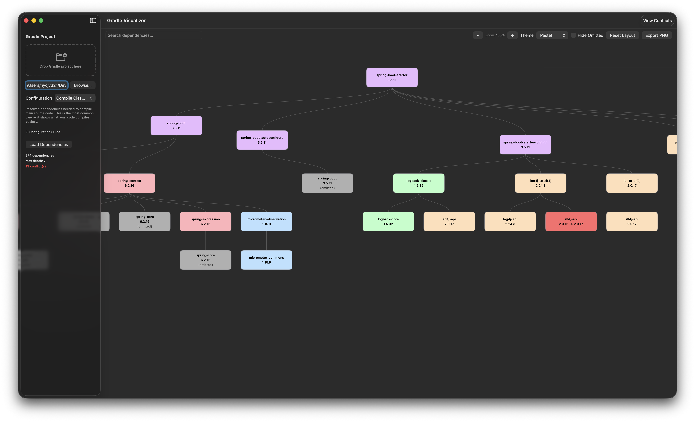

# Gradle Dependency Visualizer

A macOS SwiftUI app and CLI tool that visualizes Gradle dependency trees with interactive graph rendering and conflict detection.



## Features

### Graph Visualization
- Interactive dependency graph with Reingold-Tilford tree layout
- 11 color themes (Pastel, Ocean, Earth, Monochrome, High Contrast, Warm Gradient, Cool Gradient, Sunset, Forest, Neon, Nordic) assigned by group name hash
- Conflict highlighting (red nodes for version conflicts)
- Search with match navigation and auto-scroll
- Zoom via trackpad pinch gesture or toolbar +/- buttons (10%–300%)
- Depth limiting slider to focus on specific tree levels
- Collapse/expand subtrees via double-click
- Drag nodes to reposition manually
- Hide omitted (deduplicated) nodes toggle
- Viewport culling for performance on large graphs
- Export as PNG or JSON

### Multi-Module Project Support
- Automatic submodule discovery via `./gradlew projects`
- Module picker with select all/deselect all
- Concurrent module loading (up to 8 in parallel)
- Combined tree with synthetic module nodes as top-level roots
- Single-module fallback when no submodules are detected

### Conflict Detection
- Inline conflict detection during parsing
- Sortable conflict table (coordinate, requested version, resolved version, requested by)
- Export conflicts as JSON

### Dependency Table
- Flat mode: unique dependencies with expandable "Used by" parents and occurrence counts
- Tree mode: full collapsible hierarchy matching the original tree
- Search filtering and conflicts-only toggle
- Sortable by coordinate, version, occurrences, or group
- Export as JSON

### Dependency Diff
- Compare current tree against a baseline (JSON or Gradle text file)
- Categorizes changes as added, removed, version changed, or unchanged
- Filterable by change type, searchable, sortable
- Swap comparison direction
- Export diff as JSON

### Scope Validation
- Detects 30+ test frameworks (JUnit 4/5, Mockito, TestNG, Spring Test, AssertJ, etc.) in production configurations
- Recommends moving to `testImplementation` or `testRuntimeOnly`
- Sortable results table with export

### Import / Export
- Import dependency trees from JSON or Gradle text output files
- Export: JSON tree, PNG graph, conflict report (text/JSON), table JSON, diff JSON, scope validation JSON

### Project Selection
- Drag-and-drop Gradle project folder or `build.gradle(.kts)` file
- Browse dialog, path validation, 11 Gradle configuration options with descriptions

## Prerequisites

- macOS 14+
- Xcode 16+
- [XcodeGen](https://github.com/yonaskolb/XcodeGen) (`brew install xcodegen`)

## Quickstart

```bash
# Generate Xcode project
xcodegen generate

# Build and run the app
xcodebuild -scheme GradleDependencyVisualizer -destination 'platform=macOS' build
open GradleDependencyVisualizer.xcodeproj

# Build the CLI tool
xcodebuild -scheme GradleDependencyVisualizerCLI -destination 'platform=macOS' build

# Run tests
cd Packages/GradleDependencyVisualizerServices && swift test   # Package tests (151 tests)
cd ../..
xcodebuild -scheme GradleDependencyVisualizer -destination 'platform=macOS' test   # App tests (54 tests)
```

## How It Works

1. Drop a Gradle project folder (or browse with NSOpenPanel)
2. The app auto-discovers submodules via `./gradlew projects`
3. Runs `./gradlew [:module:]dependencies --configuration <config> --console=plain` (concurrently for multi-module projects)
4. Parses the ASCII tree output into a structured dependency tree
5. Renders an interactive graph with conflict highlighting, search, zoom, and depth control

## Architecture

MVVM with protocol-based dependency injection across three Swift packages:

```
Packages/
├── GradleDependencyVisualizerCore/           Domain models (DependencyNode, DependencyTree, etc.)
├── GradleDependencyVisualizerServices/       Business logic (parsing, execution, layout, export)
└── GradleDependencyVisualizerTestSupport/    Test doubles and factories

GradleDependencyVisualizer/                   macOS SwiftUI app
├── App/                            Entry point, DependencyContainer, ContentView
├── ViewModels/                     @Observable view models
└── Views/                          SwiftUI views (Graph/, Conflict/, ProjectSelection/)

GradleDependencyVisualizerCLI/                CLI tool (graph + conflicts subcommands)
```

Dependency flow: `App/CLI → Services → Core`. TestSupport is test-only.

## CLI Usage

```bash
# Output DOT format graph
./gradle-dependency-visualizer graph /path/to/project --configuration compileClasspath | dot -Tpng -o deps.png

# Report conflicts as text
./gradle-dependency-visualizer conflicts /path/to/project

# Report conflicts as JSON
./gradle-dependency-visualizer conflicts /path/to/project --format json

# Multi-module: list discovered modules
./gradle-dependency-visualizer graph /path/to/project --list-modules

# Multi-module: analyze a specific module
./gradle-dependency-visualizer graph /path/to/project --module :app

# Multi-module: analyze all modules (default when submodules exist)
./gradle-dependency-visualizer graph /path/to/project
```

## Documentation

See `docs/` for detailed documentation:

- [Architecture](docs/ARCHITECTURE.md) — System design, component responsibilities, domain models
- [Testing](docs/TESTING.md) — Testing strategy, infrastructure, conventions
- [Dependency Visualization](docs/feature/DEPENDENCY_VISUALIZATION.md) — Graph rendering feature
- [Conflict Detection](docs/feature/CONFLICT_DETECTION.md) — Conflict detection feature
- [Dependency Table](docs/feature/DEPENDENCY_TABLE.md) — Table view feature (flat + tree modes)
- [Multi-Module Support](docs/feature/MULTI_MODULE_SUPPORT.md) — Multi-module project discovery and loading
- [Dependency Diff](docs/feature/DEPENDENCY_DIFF.md) — Baseline comparison and change detection
- [Scope Validation](docs/feature/SCOPE_VALIDATION.md) — Test library scope checking
- [Import / Export](docs/feature/IMPORT_EXPORT.md) — File import and multi-format export
- [Project Selection](docs/feature/PROJECT_SELECTION.md) — Project setup, configuration, and loading
